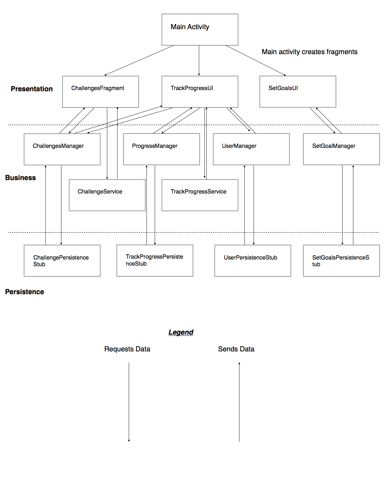

# Package Structure
The package structure for our application is as follows: 

We have 5 main packages, which consist of 
1. **Application**, 
2. **BusinessLayer**, 
3. **Models**, 
4. **PersistenceLayer** and 
5. **PresentationLayer**. 

The application package contains source code that deals with android studio specific things, and also classes that manage other classes. 
For example the services class manages all of the database stubs we have.
The BusinessLayer Package contains all of the logic of our application. Any calculations, verification, and database calls happen in this package. 
We also have a sub package called DatabaseManagers. This package has classes that strictly query each stub database.
The Models package contains all of our domain specific classes. 
The PersistenceLayer package contains the stub databases and interfaces for the databases. 
Finally, the PresentationLayer contain all of our classes that strictly deal with presenting information to the screen. 

## Source Code 

In the presentation layer, we have 3 main files. 

The first is called TrackProgressUI. This class deals with presenting current progress 
to a user by showing them a progress bar, steps taken, calories burned and distance. This class makes use of the ProgressManager class for 
to query the database for a users current progress, the UserManager class to get the current users information, and the TrackProgressService class 
to do calculations.

The second is called ChallengesFragment. This class presents to the user a list of currently available challenges, as well as an option for the 
user to create new challenge. If a user clicks on a challenge in the list, and new page is opened (the file is CurrentChallenge) where they can then start the challenge, 
which then starts the TrackProgessUI page. If a user clicks on the Create Challenge button, a modal window is opened where they can specify 
the challenge, and see it added to the list. This class makes use of the ChallengesManager class in order to add and get the current challenges 
in the database, and the ChallengesService class in order to perform verification.

The third class is called SetGoalsUI, which allows a user to set a specific goal the want to achieve. It makes use of the SetGoalManager class which adds the goal to the stub database. 

Our persistence layer has 4 stub databases and 4 database interfaces. The stub databases are ChallengePersistenceStub which stores all 
available challenges, SetGoalPersistenceStub which stores the goals for a user, TrackProgressPersistenceStub which tracks the progress 
for a users current challenge, and UserPersistenceStub which stores users. Each has a respective interface.

Our Business layer has 4 classes that stricltly deal with managing the database. They pass our model objects to it and retrieve model objects from it. We also have two more classes that deal
with logic, and all the logic in those classes are related. For example, our TrackProgressService class has logic related to tracking a challenge.

Finally, our Models package contails classes that represent the domain specific information we need. We need information for challenges, the current progress, the user and the users goals, so we have
models for each of those.

## Current Fucntionality of the App
The app currently has 3 pages, namely Challenges, Current Progress and Set Goals. The challenges page displays a list of currently avaialble challenges, which can be clicked on to see more details.
The details page is fully functional, but will later get some TLC to improve its looks a bit more. The details page allows users to then start a challenge, and once its started it cannot be undone, 
and another challenge cannot be started until this one is finished. If you go back to the challenges page, there is a create challenge button that opens a dialog window, where you can createa  custom
challenge. That challenge will be added to the list of challenges and can be completed. The Current Progress page initially shows nothing but an empty progress bar and 0 values. This is because no challenge
has been started. Once you start a challenge, go back to the Current Progress page, which will start tracking your steps(just move the phone around), showing you the distance youve travelled, calories burned, 
and the time remaining. The set goals page allows you to set your own personal goals. This page currently just takes the user input and stores the goal in the database when the button is pressed. This page will
be worked on more in iteration 2.